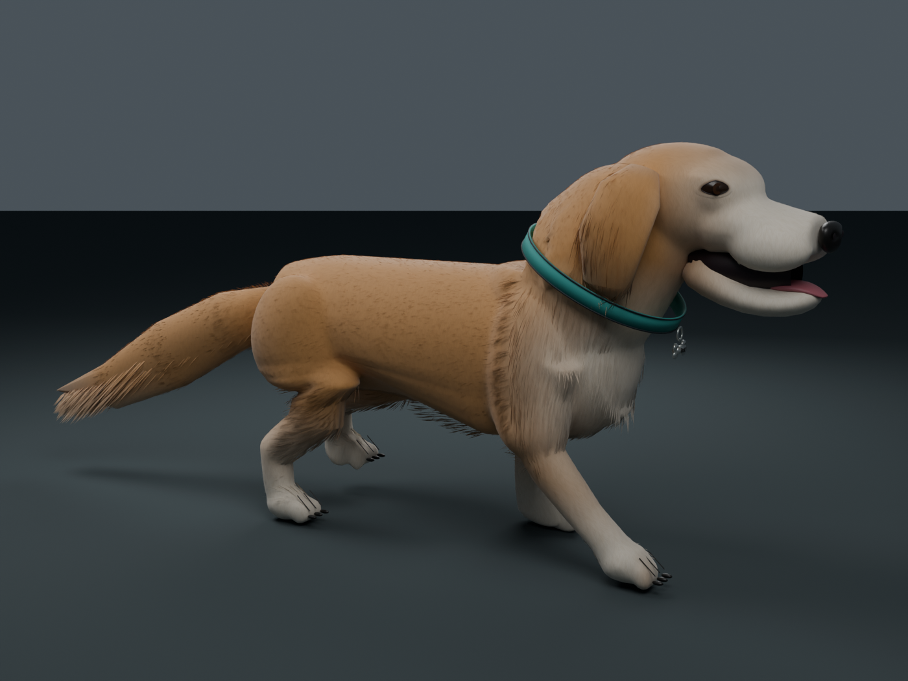

# Rex companion asset

An original game interpretation of the user's golden retriever: honey-gold coat, cream muzzle, brow, chest and paws, dark almond eyes, black nose, hanging ears, feathered tail, turquoise collar and a bone-shaped **Rex** tag. The private reference photographs are not copied, embedded or sampled into any asset.

The current Blender previews show likeness revision 4's actual mesh and rig. This refinement shortens and broadens the cream muzzle, lowers and flattens the nose, fits smaller almond eyes into softly shaded lids, removes the drawn lower-lip curve, narrows the chest and tucks the abdomen. Rounded individual toe shapes replace stump-like paws. The existing strand budget is redistributed toward chest, ear and leg feathering rather than increased. Facial surfaces face outward for the one-sided game materials. The face and coat remain stylized; photographic likeness is not claimed. Revision 4's source validation and Unreal import are complete. In-game appearance and animation review of this revision remain pending.

| File | Purpose |
| --- | --- |
| [CompanionDog.blend](Source/CompanionDog.blend) | Editable mesh, 24-bone rig, two actions, materials and review lighting |
| [likeness.py](Source/likeness.py) | Anatomical finish, short opaque coat, face, collar and planted-foot walk authoring |
| [SK_CompanionDog.fbx](Exports/SK_CompanionDog.fbx) | Source skeletal mesh; exact triangle count and bounds in manifest |
| [A_DogIdle.fbx](Exports/A_DogIdle.fbx) | Three-second breathing, head, ear and tail loop |
| [A_DogWalk.fbx](Exports/A_DogWalk.fbx) | 0.433333-second in-place four-beat walk |
| [dog_manifest.json](dog_manifest.json) | Dimensions, bones, materials, timing, stride and FBX hashes |
| [source_validation.json](source_validation.json) | FBX round-trip skinning, clip duration and loop checks |
| [Source validator](Source/validate.py) | Repeats offline FBX bone, material, weight, finite-geometry, hash and loop checks |
| [Preview renderer](Source/render.py) | Renders the saved mesh and animations without regenerating or exporting them |
| [Generator](../../Tools/create_companion_dog.py) | Recreates source geometry in Blender 4.5 using the retained coat swatch |
| [Unreal importer](../../Tools/import_companion_dog.py) | Targeted skeletal import, material creation, three LODs and validation |

Coordinates are **centimeters, +X forward, +Z up**, with a ground-level root and no root motion. Exact current dimensions are recorded in the manifest. Import at actor scale 1; do not multiply this real-scale animal by the simulation's graphics scale. Standing eyes are approximately 80 cm high. The separately configured first-person camera can hide the local body to avoid clipping.

The walk has a **0.6018518518518519 m full stride over 13/30 seconds**, matching **5 km/h (1.3888888889 m/s)**. Each foot spends 60% of its cycle planted at a fixed height, moving backward relative to the body at the reference travel speed; swing uses a lifted return. Runtime should sample `frac(distance_walked_meters / stride_meters) * duration_seconds`. This preserves phase when speed changes. It does not provide runtime foot IK for uneven terrain. The generated action validates ankle-target error; the exported FBXs are separately checked for normalized weights, timing and matching loop endpoints.

The importer targets `/Game/Art/CompanionDog/SK_CompanionDog`, `A_DogIdle` and `A_DogWalk` on a shared skeleton. It checks dimensions, vertex colors, bones and durations, then creates three skeletal LODs. The final coat uses short **opaque** geometry plus fine texture relief; earlier long masked ribbons are removed. No groom simulation, physics asset or root-motion movement is included. Unused legacy material definitions may remain in source slots.

Revision 4 contains **118,331 source triangles** and the same 24 bones, down from 119,651 triangles in the previous revision. Its FBX round trip passes finite geometry, normalized weights (at most four influences), exact bone/material names, current export hashes, and both animation duration/loop checks. Source bounds span approximately **183.47 × 38.09 × 86.21 cm**; the clips retain their three-second idle and 13/30-second walk. The current [Unreal import report](import_report.json) verifies matching bounds, all 24 bones, ten material slots, vertex colors and three LODs with **214,490 / 44,642 / 20,077 imported vertices**. These are vertex counts, not triangle counts. The import log records a bind-pose warning followed by successful automatic bind-pose recreation; runtime animation review is still required. The offline source validator's `unreal_import_verified: false` describes its own limited scope; the separate import report records the completed Unreal checks.

Geometry, rig and clips are authored for this project. Three retained maps (`FurNormal`, `FurDetail`, `FurAlpha`) are procedural; the final coat also uses a text-generated `CoatDetail` swatch. Its exact prompt and method are recorded in [TEXTURE_PROVENANCE.md](TEXTURE_PROVENANCE.md). No external dog mesh or third-party dog photograph is redistributed. Successful Unreal import writes `import_report.json`; runtime walking and first-person control require separate game verification.

