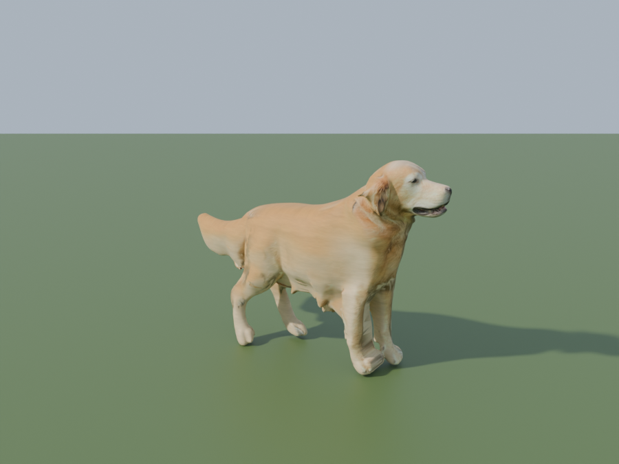
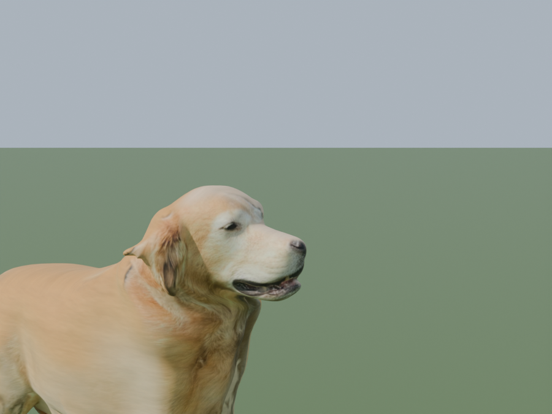
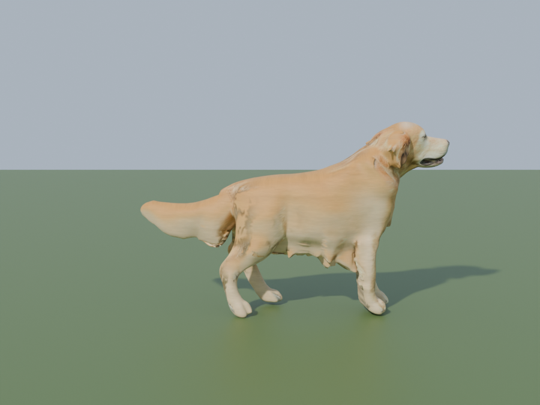

# Rex companion asset

A game asset of the owner's golden retriever, built from the owner's own photographs at the owner's request (likeness revision 6/7, 2026-10-08). It replaces the procedurally modelled revisions 1–5, whose silhouette never read as a retriever in the engine.

## How it is made

1. **Base mesh.** The standing three-quarter photograph (background removed with `rembg`, kept untracked in `Saved/rex_photos/`) is sent to Tencent's hosted Hunyuan3D-2.1 image-to-3D model (`/shape_generation` endpoint of the public Hugging Face Space, called with `gradio_client` by [`Tools/generate_rex_image_to_3d.py`](../../Tools/generate_rex_image_to_3d.py)). The returned shape-only GLB (`Source/generated/hy21shape_generation_0.glb`, 278,534 triangles, Git LFS) is a real retriever: skull, hanging ears, open mouth, chest, legs and a hanging tail. Hunyuan3D-2.0's shape endpoint produced a comparable mesh; the textured endpoint of either model needs a paid GPU tier and was not used.
2. **Alignment and pose normalisation** ([`Tools/build_rex_from_generated.py`](../../Tools/build_rex_from_generated.py)). The GLB is rotated nose-forward (+X), grounded, scaled to a **59 cm** back height at the mid-trunk, centred on the spine and decimated to **48,000 triangles**. Legs are measured from a 10–14 cm slice and slid into a symmetric stance (fore ±8 cm, hind ±8.1 cm); the head is turned to face +X and pitched to carry the nose 8° above level; the tail, which the generator reproduced hanging and curled to the photographed side, is rotated to a level carriage with a lifted tip so it clears the grass sward.
3. **Coat albedo.** Before the warps, every vertex is projected orthographically onto the photograph from the camera side (the far side mirrored), weighted by how directly the surface faces the camera; the tail and any off-face sample darker than linear luminance 0.16 (shadowed chest, ground between the legs) are rejected. The sampled colour is blended with authored zoning (gold back, cream chest, legs and belly, pale muzzle and brow) and baked in Cycles into **`Textures/T_Dog_Albedo.png`** (2048², sRGB) on a smart-unwrapped UV0. That texture therefore contains pixels derived from the owner's photograph; the photograph itself is not committed.
4. **Rig, skinning and clips.** The existing 24-bone skeleton (root, pelvis, spine, neck, head, jaw, three bones per leg, ears, tail_1–4) is fitted from the measurements; distance-based weights with at most four influences. The idle loop is authored in the build script; the walk is the planted-foot cycle from [`Source/likeness.py`](Source/likeness.py) (`author_walk`, 0.6018518518518519 m stride over 13/30 s at 5 km/h).
5. **Feathering cards** are still generated on request (`--cards`, with `--card-length=` and `--card-density=` scales) but are **off by default**: in the engine they read as dark straw at every zoom a player can reach.
6. **Unreal import** ([`Tools/import_companion_dog_v3.py`](../../Tools/import_companion_dog_v3.py)) targets `/Game/Art/CompanionDog/SK_CompanionDog`, `A_DogIdle` and `A_DogWalk` (paths unchanged, so `Rules/companions.json` and the save fingerprint are untouched), builds three LODs and creates the materials. `M_Coat` is default-lit: the baked albedo × a box-projected fur-flow mask in mesh space (strands run nose-to-tail), darkened to 0.7 and desaturated by 0.22 so that under the colony sun it lands on the photograph's pale gold instead of clipping to white on the face and saturating to orange on the body (the subsurface model of revision 6 did exactly that), with a mild grazing-angle lift standing in for guard-hair scatter. Stale material slots from earlier revisions are kept bound to `M_Coat` with a warning.

## Files

| File | Purpose |
| --- | --- |
| [CompanionDog.blend](Source/CompanionDog.blend) | Review scene: skinned mesh, rig, both actions, bake materials (Git LFS) |
| [Source/generated/](Source/generated/) | Hunyuan3D shape output used as the base mesh (Git LFS) |
| [likeness.py](Source/likeness.py) | Walk authoring and stride metadata (shared with earlier revisions) |
| [render_v5.py](Source/render_v5.py) | Cycles preview renders of the saved scene (`--quick`, `--views=`) |
| [dog_manifest.json](dog_manifest.json) | Dimensions, bones, materials, timing, stride, skeleton fit and FBX hashes (revision 6 format) |
| [Generator](../../Tools/build_rex_from_generated.py) | Blender 4.5 build from the generated GLB (`--mesh=`, `--tris=`, `--preview-only`, `--cards`) |
| [Image-to-3D client](../../Tools/generate_rex_image_to_3d.py) | Hosted shape generation from the untracked photograph |
| [Unreal importer](../../Tools/import_companion_dog_v3.py) | Skeletal import, three LODs, materials, runtime checks |

Exports (`Exports/*.fbx`) are regenerated by the build script and are not committed. Coordinates are **centimeters, +X forward, +Z up**, ground-level root, no root motion; import at actor scale 1.

## State in the engine (revision 7f)

Reviewed with the opt-in benchmark camera (`-GraphicsBenchmark -BenchmarkView=rex`, optional `-BenchmarkZoom=`, `-BenchmarkYaw=`, `-BenchmarkPitch=`; screenshots under `Saved/Screenshots/Benchmark/rex-*`). At the closest zoom a player can reach (`minimum_zoom` 120) Rex is about 200 px wide and reads as a pale golden retriever with a white face and a level tail. The rex view runs at 101–121 FPS on the development PC. Known limits, in order of visibility: the coat is smooth (no strand fur; the fur-flow mask is subtle), the head-to-body colour transition is harsher than in the photographs, the far side of the body carries the mirrored near-side photo, and the eyes and nose come only from the bake. Strand-based fur (UE Groom) was not attempted: at 200 px it would cost far more than the grass system for a blob.

## Privacy and provenance

The owner supplied the photographs and asked for the likeness. The photographs were uploaded to the public Hunyuan3D Space to obtain the shape and are otherwise kept out of the repository; the committed `T_Dog_Albedo.png` and the generated GLB are derived from them and are published with the rest of this public repository. `T_Dog_CoatDetail.png`, `FurNormal`, `FurDetail`, `FurAtlas` and `FurAlpha` are procedural or text-generated as recorded in [TEXTURE_PROVENANCE.md](TEXTURE_PROVENANCE.md).

