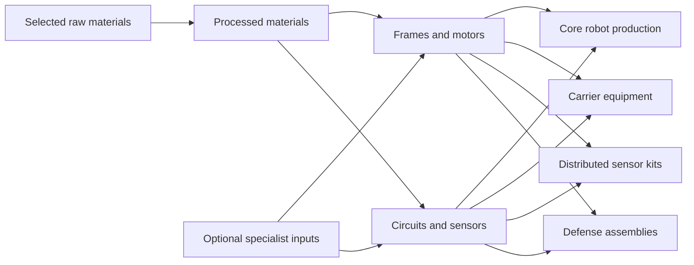

# seige2222 — Production Dependencies and Starter Viability

[Design index](README.md) · [Status definitions](README.md#design-status)

A review of the proposed resources and building functions, with a suggested manufactured-item network for the current robotic colony. This develops discussion material; it does not approve the catalog, recipes, costs, or a starting supply package.

Actual Unreal prototype development is now authorized. The narrower chain being implemented and its explicit assumptions are recorded in [First Playable Scope](FIRST_PLAYABLE_SCOPE.md); the broader suggestions here remain proposals.

Separate [resource proposals](RESOURCE_PROPOSAL.md) and [building proposals](BUILDING_PROPOSAL.md) develop candidate catalog revisions. The tables here review the original catalog and its dependencies; they are not a competing confirmed specification. Where candidate chains differ, their selection remains open.

## v0.6 presentation boundary

The v0.6 source changes resource/building presentation metadata and interpolated visible work, not costs, throughput, construction time, workforce capacity or AI plans. Couriers remain the only physical inter-building material transfer; stockpile and worker animations cannot award resources. Construction still requires a full delivered bill before timed work. Static validation passes 32 negative cases. The v0.6 editor compiled; 34 native tests passed cleanly (zero warnings, failed or unrun) and its 79-stage editor interaction route passed with zero failures. The v0.6 Shipping interaction route also passed 79 stages with zero failures and exit 0, recording 831 courier-motion frames between fixed ticks at 1× speed (`Saved/packaged-v0.6.0-UiSmoke-verification.json`). The v0.5 viability results below remain version-specific historical evidence.

## v0.5 concrete bootstrap in source

The prototype now uses a finite, physically carried core deployment kit, operating stock and starting robots. Core deployment precedes normal operation. The starter core supports enough population to keep its jobs filled while two robots construct the first charging/service bay. The completed bay adds population capacity and consumes local delivered maintenance components. Both native and static rule loading validate that some buildable support expansion can be constructed and staffed within starter capacity.

Queued construction reserves only core stock left after earlier reservations and protected operating buffers. Worker construction begins after the full material bill is physically delivered. Production continues to require local inputs. This makes the first service expansion and extraction/processing chain finite-resource bootstrap problems; definitions and static reachability alone do not establish survival. The final v0.5 native suite passed all 29 tests (28 clean, one editor background HTTP-warning success; zero failed or unrun). Actual construction, service expansion and a normal-action first-objective strategy are covered without granting inventory during play; the objective succeeded at 435 simulation seconds. The Shipping package separately passed 63 interaction stages with zero failures and exit 0. These checks establish one finite winning strategy and the tested interaction paths, not indefinite sustainability; [the development report](../DEVELOPMENT_REPORT.md) records packaged and native boundaries.

The proposals and open full-game questions below remain separate from this selected prototype mechanism. See [First Playable Scope](FIRST_PLAYABLE_SCOPE.md).

## Progression through production

**Confirmed direction:** There is no research tree, research timer, or research currency. What might informally be called an item “tech tree” is a production dependency network: resources and constructed buildings make capabilities available. Shared inputs can connect multiple branches rather than forming one linear ladder.

The existing scope remains approximately 10–15 raw resources, with a fair subset in each sector. Both common and rare materials may enable capabilities or improve existing products. The following 12-material list and its common/rare assignments remain proposals.

**Established operating requirements:**

- The population is robots. The core automatically produces robots for open jobs and reduces population when job demand falls; there is no player-maintained population target.
- Robot production has a maximum output rate and also requires sufficient inputs. Resource production has defined rates per time unit; more population alone cannot bypass extraction limits.
- Buildings automatically staff and operate when sufficient workers and inputs are available. Production, hauling, and repairs are automatic, and the player can turn buildings off.
- Raw materials and manufactured goods are physical batches or chunks. Dependency arrows never imply instantaneous delivery: goods must reach their destinations.
- Population-serving commodities compete with defense and expansion for industrial resources. The actual robot needs remain open.
- Each player has one central command center/central zone, housing central command and the orbital shuttle. The core moves with relocation. Remote extraction in empty neighboring sectors is a risky extension, not a second core.
- Fleets operate on land using vehicles and mechs. Mission direction and direct fleet movement are allowed, with no individual-unit combat micromanagement. Aggression settings govern autonomous or offline behavior.

**Provisional:** The core is the sole producer of new population. A unique high-end lithography capability is a possible explanation, not an approved process, recipe, or separate building. Its implications for other electronics manufacturing remain open.

## Review of the 12 proposed raw materials

Every row below is proposed content. “Retain for discussion” does not select a resource or make it a starting requirement.

| Proposed class | Material | Industrial role to explore | Review for the robot-only scope |
| --- | --- | --- | --- |
| Common | Water | Processing, cooling, and chemicals | Retain for industrial discussion. Human drinking-water demand is deferred; robot water consumption is not established. |
| Common | Biomass | Polymer feedstock or fuel | Its industrial role can survive removal of human food needs. Decide whether cultivating or gathering it creates worthwhile choices. |
| Common | Iron ore | Refined metal, steel, frames | Strong candidate for a shared structural input across robots, buildings, and defenses; exact uses remain proposed. |
| Common | Copper ore | Conductors, motors, electronics | Candidate shared input connecting machinery and control systems. |
| Common | Silica | Glass, optical components, electronics substrates | Could connect sensors and electronics; processing stages are undecided. |
| Common | Carbon | Steel, polymers, filters, composites | Could connect metal and chemical branches. Avoid adding multiple near-identical products without distinct uses. |
| Common | Aluminum ore | Lightweight structures and components | Could support mobility or efficiency choices. It need not be a universal prerequisite for basic robots. |
| Rare | Titanium ore | Advanced frames and armor | Candidate specialization branch; being rare does not itself require higher-tier placement. |
| Rare | Rare-earth minerals | Precision motors and sensors | Could improve specialized equipment or enable particular products; the choice is open. |
| Rare | Fictional superconductive crystals | Advanced power equipment or electromagnetic weapons | Optional fictional branch to evaluate after basic industrial roles are clearer. No power model or weapon type is selected. |
| Rare | Catalytic minerals | Chemical or fuel processes | Could enable a process or improve its output; no efficiency formula or catalyst-consumption rule is established. |
| Rare | Unnamed exotic mineral | Possibly shields | Least-defined candidate. Give it a distinct gameplay role before committing a resource slot to it. Shields remain a proposal. |

**Review finding:** The list supports several plausible interconnected industries, but not every proposed raw needs to appear in the first chain. Retaining water and biomass for industrial use does not restore human food requirements. The distinction between indispensable starter inputs and optional specialization inputs is still missing.

## Review of the 16 proposed building functions

The building catalog remains proposed. Confirmed functions do not establish that each function needs its own building, nor that the original names are final.

### Building categories

**Confirmed broad direction:** Buildings need at least three categories: **resource-related**, including gathering and storage; **logistics**, including movement, trade, storage, and possible robot charging or repair facilities; and **defense**. Storage overlaps the first two categories. Resource and logistics buildings may have secondary defensive capabilities rather than being forced into pure roles.

**Organizational proposal:** Use a primary functional category with secondary tags where useful. This is a suggested way to organize the catalog, not a selected interface or a rule that resolves every overlap. Charging/repair facilities remain possibilities, and assigning a defense tag would not automatically give every industrial building weapons.

The assignments below are proposals under that broad categorization; manufacturing is provisionally grouped with resource-related industry.

| Existing proposed building | Suggested grouping | Current function or candidate role | Review and status |
| --- | --- | --- | --- |
| Core | Cross-cutting resource, logistics, and defense functions | Sole central command center, shuttle location, defense, automatic population production and reduction | One central core is established. Exclusive robot production is a separate provisional rule. Relocation moves the core; exact packaging and construction inputs remain open. |
| Habitat | Logistics, if adapted | Originally human housing | Human housing is deferred. A robot service or accommodation role could be explored, but no replacement building or robot housing need is selected. |
| Waterworks | Resource-related | Water extraction and processing | Remains a candidate if water has selected industrial uses. It is not automatically a civilian survival building. |
| Cultivation facility | Resource-related | Originally food and biomass | Human food production is deferred. Industrial biomass cultivation could justify this function, subject to selecting the feedstock chain. |
| Mine / extractor | Resource-related | Raw-resource extraction | Extraction is established. Exact facility types and whether rate limits attach to sites, facilities, or another unit remain open. Remote sites do not create another central core. |
| Refinery | Resource-related | Converting raw resources into usable materials | Candidate processing stage. Number of material-specific facilities versus one general refinery is undecided. |
| Chemical plant | Resource-related | Polymers, fuels, and possible process supplies | Candidate link between biomass/carbon and manufactured equipment. Fuel and robot-service products are not selected. |
| Power plant | Resource-related; possible logistics connections | Power production | Still a proposed building. No generation, distribution, storage, or consumption model is established. |
| Machine works | Resource-related | Frames, motors, and mechanical components | Useful candidate shared manufacturing function for population equipment, logistics, and defense. |
| Electronics facility | Resource-related | Circuits, control systems, and sensors | Candidate shared manufacturing function. Do not infer a complete electronics process from the lithography explanation for the core. |
| Advanced assembly | Resource-related | Combining manufactured components into larger systems | Candidate equipment assembly function. It does not establish a second producer of robot population. |
| Depot / logistics facility | Logistics with resource-storage overlap | Storing and moving physical goods | Physical storage and automatic hauling are established. A dedicated depot, its service area, and carrier requirements remain proposed. |
| Trade terminal | Logistics | Access to external raw materials and products | Trade is established direction; this particular building, its access conditions, and transaction mechanics are not selected. |
| Fleet yard | Logistics with defense-related functions | Fleet equipment manufacture, outfitting, and repair | Ground fleets are established and repairs are automatic. The yard and the division of work among it, factories, and the core remain proposed. |
| Defensive emplacement | Defense | Fixed protection | Fixed defenses are established direction. Individual weapons, structures, recipes, and ranges remain open. |
| Barriers / gates | Defense with logistics implications | Perimeter control | Proposed protection and access structures. Their physical blocking rules and interaction with land fleets are undecided. |

**Additional candidate function:** Distributed sensor installation and servicing. Resource-costly sensors that can be stolen are established; whether their manufacture, installation, and upkeep require a dedicated facility is open. A sensor should not become a seventeenth mandatory building merely because this function needs representation.

Robot charging or repair stations are additional possible logistics functions, not confirmed new facilities. Automatic repair is established, but neither a repair-station requirement nor charging recipes follow from it.

**Review finding:** The largest adaptation is replacing the old assumption that housing and food define civilian industry. First determine which commodities support robots, then decide whether existing facilities can supply them. Keep power generation and robot-service facilities visibly proposed until their underlying systems are selected.

## Suggested manufactured-item network

**Assistant proposal — fictional recipe sketches only.** The following network extends the earlier examples to make shared dependencies visible. It is neither a complete recipe graph nor a validated manufacturing process. There are no selected quantities, costs, durations, yields, energy requirements, or building-construction recipes. These stages do not define the loot tiers.

| Candidate output | Illustrative input combination | Candidate producer | Possible uses |
| --- | --- | --- | --- |
| Steel | Refined iron + carbon | Refinery | Frames, motors, armor |
| Polymer | Biomass + processed carbon | Chemical plant | Circuits, equipment components |
| Conductors | Processed copper | Refinery or machine works | Circuits, motors, equipment assemblies |
| Control circuits | Conductors + processed silica + polymer | Electronics facility | Robot control, sensors, machinery |
| Structural frame | Steel | Machine works | Robots, carriers, defense equipment |
| Motor | Steel + conductors + control circuits | Machine works | Robots and mobile equipment |
| Power assembly | Conductors + control circuits + structural components | Electronics or advanced assembly | Possible equipment component; this does not select how energy is generated or consumed |
| Basic robot | Structural frame + motor + control circuits; possible power assembly | Core | New population produced to meet jobs; exact input selection remains open |
| Sensor module | Processed silica + control circuits + conductors | Electronics facility | Remote installations and targeting equipment |
| Sensor installation kit | Sensor module + structural frame + possible power assembly | Advanced assembly | One possible way to build distributed coverage; theft need not preserve this kit form |
| Cargo module | Structural frame + polymer | Machine works | Capacity for hauling; dimensions and capacity units remain open |
| Carrier equipment | Structural frame + motor + control circuits + cargo module | Advanced assembly or fleet yard | Candidate ground-hauling equipment; exact vehicle or mech chassis and local carriers remain open |
| Precision motor | Motor + rare-earth-derived components | Machine works | Candidate specialization for sensors, targeting, or advanced mobility |
| Targeting assembly | Sensor module + control circuits + precision motor | Electronics or advanced assembly | Candidate advanced defense input |
| Armored frame | Structural frame + titanium-derived components | Machine works | Candidate upgraded defenses or mobile equipment |
| Advanced defense assembly | Armored frame + targeting assembly + possible power assembly | Advanced assembly | Example deep manufacturing endpoint; not the starting core's mandatory supply chain |

The core already starts with defensive capability. Its existence does not imply that the colony must first build the proposed advanced-defense branch. Similarly, the robot recipe sketch does not establish a viable opening: starting supply and construction dependencies still need to be resolved.

**Simpler starter alternative:** A basic equipment branch could use iron, copper, silica, and carbon while postponing polymers and specialist materials to upgraded products. This alternative would revise the illustrative circuit recipe above and must be evaluated as a coherent chain before selection. See the separate [resource proposal](RESOURCE_PROPOSAL.md); neither candidate is an approved bootstrap.

All branches in this diagram are suggested product groupings. They share industrial inputs, so expanding the workforce, hauling capacity, sensor coverage, and defenses could compete for production. Every material transfer would still require physical movement.

**Further branch suggestions, not selected content:** Aluminum could support a lightweight equipment variant; titanium could support armor; rare-earth components could support precision equipment. Land vehicles and mechs are the current fleet direction; particular models could reuse frames, motors, control systems, and equipment assemblies. This would not decide whether such units are population members, equipment operated by robots, or autonomous fleet assets. Mission commands, fleet movement, and aggression settings do not imply individual-unit production or combat micromanagement. Crystal, catalyst, and exotic-mineral branches can remain unfilled until their distinct role is worth adding.

**Population-serving branch still open:** Maintenance parts or service supplies could reuse mechanical and chemical inputs, giving the civilian economy a robot-appropriate material role. Neither these goods nor their effects on satisfaction, consumption, repair, or revolt have been selected. They cannot yet be treated as a complete replacement for the deferred food and household-goods list.

## Rates, staffing, and physical availability

The selected recipes will need to work with the established automatic colony operation:

- An open job can create demand for a robot, but it does not bypass the core's production ceiling or input requirements.
- A new worker does not by itself raise extraction beyond its defined rate. The rate's scope and any upgrade effects are open.
- Materials in a remote silo do not make a recipe immediately executable at another facility. Automatic transport must deliver them.
- Shared components create competing demand among enabled activities. The allocation rule remains open; this document adds no manual production queues or priority lists.
- Lower job demand triggers automatic population reduction. No refund, recovered component, deactivation store, or dismantling recipe is assumed.
- Robot-production exclusivity, if selected, would concern new population. It would not by itself settle where repair parts, fleet equipment, or sensors are made.

## Starter viability: questions and proposals

The confirmed opening supplies a command center and some robots, with exact starting stocks open. Ordinary threats can arrive immediately; repairs are automatic and the core must remain serviceable. The proposed chains above are not evidence that this opening already works.

There is only one central core to organize this opening. A remote extraction operation, including one in an empty neighboring sector, extends its supply network rather than supplying a second independent core. Core movement during relocation also needs a viable re-establishment chain; exact transported assets and the relationship to emergency launch remain matters for the relocation design. Core-only robot production is still provisional and should not be inferred merely from the one-core rule.

| Dependency to resolve | Proposal to explore, not a selected answer |
| --- | --- |
| First construction needs products from buildings that do not yet exist | Compare a finite starting component stock with limited starter processing in existing facilities. Do not assume either bootstrap. |
| Expanding production needs workers, but producing workers needs that production | Check the chain using only the starting workforce and selected starting assets, before counting any newly made robots. |
| Repair, robot support, and expansion compete immediately | Select their basic material demands together so the opening can sustain manageable pressure without a protection period. |
| A sector has only a subset of the raw catalog | Explore which basic functions must work locally and which can wait for trade or expansion. Do not require every proposed material in every starting sector. |
| New jobs disappear temporarily when a building lacks inputs | Resolve what counts as job demand before specifying reduction timing; temporary shortages should not be silently assumed to remove jobs. |
| Automatic reduction could return materials | Decide the mechanism and any recovery explicitly before counting surplus robots as an input source. No recycling loop is currently approved. |
| A remote input exists but cannot yet be hauled | Include a physical delivery route and its labor/equipment needs in the opening dependency check. |
| Relocation moves central command while remote industry may remain | Check how the one core can resume operation at its destination using the assets actually transported; do not assume it carries every remote factory or stockpile. |

**Recommended next catalog decision:** Choose the basic robot-production inputs and the initial robot-support/automatic-repair supply families together. This will reveal which raw materials and factory functions form the colony's industrial foundation, and which can remain optional branches. Explore that broad grouping before fixing detailed costs, quantities, or a full advanced catalog.

## Related documents

- [Resource Proposal](RESOURCE_PROPOSAL.md)
- [Building Proposal](BUILDING_PROPOSAL.md)
- [Provisional Resource, Building, and Product Catalog](PROVISIONAL_CATALOG.md)
- [Resources, Industry, and Progression](RESOURCES_AND_INDUSTRY.md)
- [Population, Necessities, and Morale](POPULATION_AND_MORALE.md)
- [Colony Operations and Player Control](COLONY_OPERATIONS_AND_PLAYER_CONTROL.md)
- [Core Loop and First Playable](CORE_LOOP_AND_FIRST_PLAYABLE.md)
- [Fleets, Physical Logistics, and Loot](FLEETS_AND_LOGISTICS.md)
- [World, Visibility, and Relocation](WORLD_AND_RELOCATION.md)
